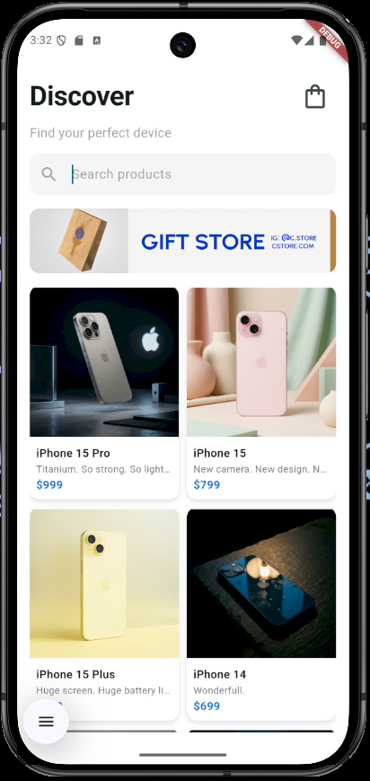
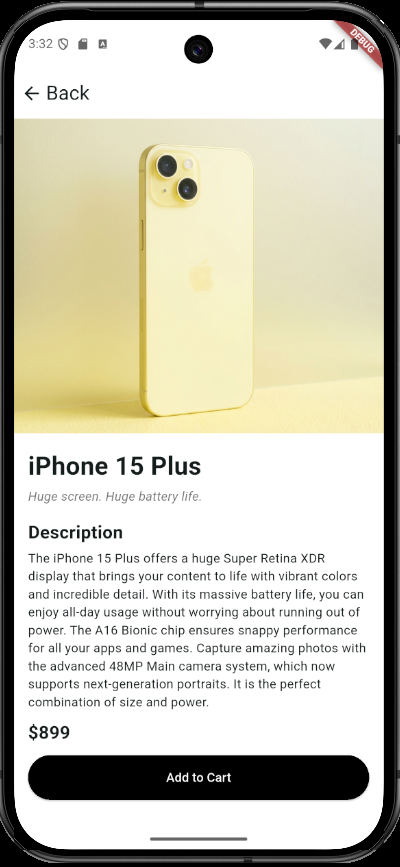
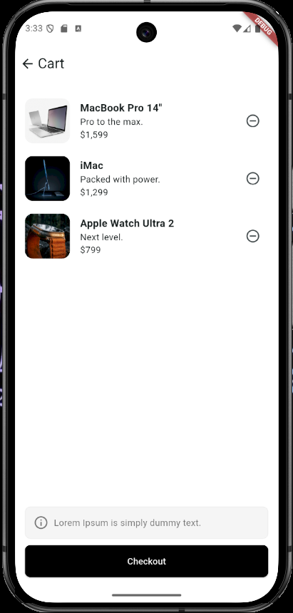

# 🛍️ Mini Catalog App

A Flutter-based mini catalog application built as part of a weekly Flutter training program. This project demonstrates core Flutter concepts including navigation, API integration, GridView layouts, and state management.

---

## 📱 About the Project

This is a beginner-friendly Flutter project that simulates a product catalog experience. It consists of three main screens: a home page, a product listing page, and a product detail page — all connected via Flutter's Navigator and Route Arguments.

---

## 🚀 Getting Started

### Built With

- Flutter **3.41.4**
- Dart **3.11.1**

### Installation & Run

```bash
# 1. Clone the repository
git clone https://github.com/Esrefylmz/mini-catalog-app.git

# 2. Navigate to the project directory
cd mini-catalog-app

# 3. Get dependencies
flutter pub get

# 4. Run the app
flutter run
```

> Make sure a device or emulator is connected before running `flutter run`.

---


## 📸 Screenshots

| Home | Product Detail | ShoppingCart |
|------|-------------|----------------|
|  |  |  |


